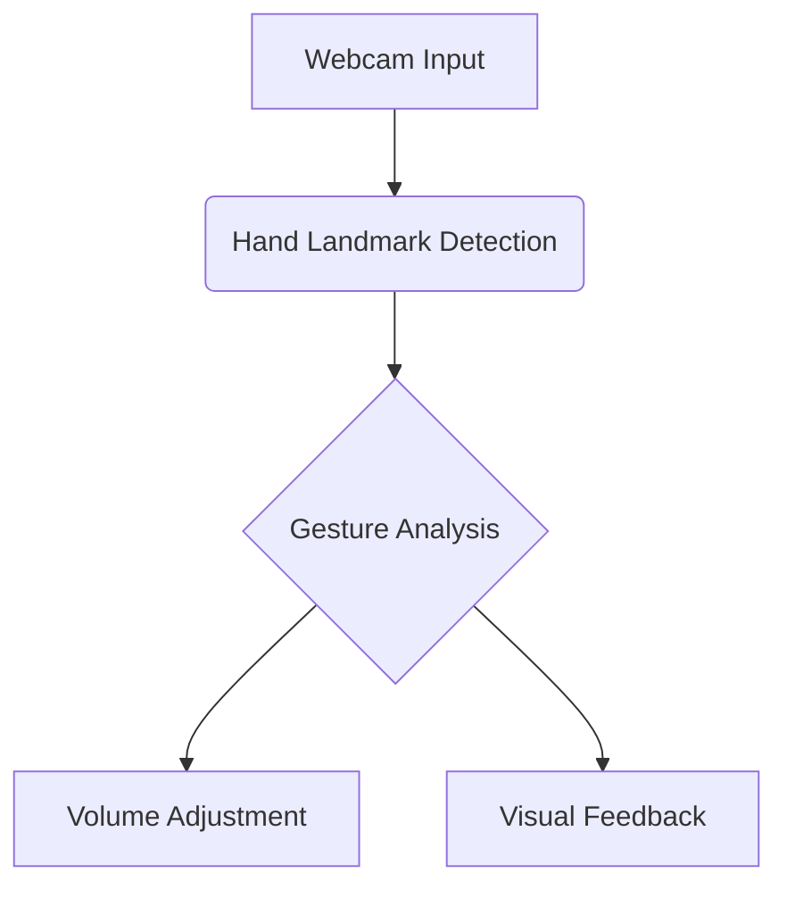

# Gesture-Controlled Volume System


## Overview
This application enables touchless volume control through hand gestures, using computer vision and machine learning to detect finger positions and adjust system volume accordingly.

## Key Features
- Real-time hand tracking with 21 landmark points
- Intuitive pinch/spread gestures for volume control
- Visual feedback with dynamic volume bar
- Cross-platform compatibility (Windows/Linux)
- Object-oriented design for easy extension

## System Architecture


## Installation

### Requirements
- Python 3.8-3.11 (MediaPipe doesn't support 3.12+ yet)
- Windows or Linux (with sounddevice for Linux)

```bash
# Core dependencies
pip install opencv-python mediapipe numpy

# Platform-specific audio control
pip install pycaw  # Windows
pip install sounddevice  # Linux alternative
```

## Usage

```bash
python volume_control.py
```

**Gesture Controls:**
- 👆 Index finger and thumb apart → Increase volume
- 🤏 Pinch fingers together → Decrease volume
- Press 'q' to exit

## Technical Implementation

### Core Components
1. **Hand Tracking** (`mp_hands.Hands`)
   - Detects 21 hand landmarks at 30+ FPS
   - Model complexity 0 (optimized for real-time)

2. **Volume Control** (`pycaw`)
   - Interfaces with Windows Core Audio API
   - Precision volume adjustment in decibels

3. **Visual Feedback**
   - Real-time hand skeleton rendering
   - Dynamic volume level indicator

### Key Methods
```python
def _initialize_volume_interface(self):
    """Sets up Windows audio control interface"""
    
def _get_landmark_positions(self, hand_landmarks, image):
    """Converts normalized landmarks to pixel coordinates"""

def _draw_hand_landmarks(self, image, hand_landmarks):
    """Renders hand connections and landmarks"""
```

## Documentation
For detailed documentation and use cases, visit our [Wiki Pages](https://github.com/Elisha3540/final-project/wiki)

## Future Enhancements
- [ ] Voice feedback integration
- [ ] Multi-hand gesture support
- [ ] Mobile deployment (Android/iOS)
- [ ] Gesture customization interface

## Contributors
- Chibhememe Elisha
- Oludotun Fawole

## License
[MIT License](LICENSE)
```

